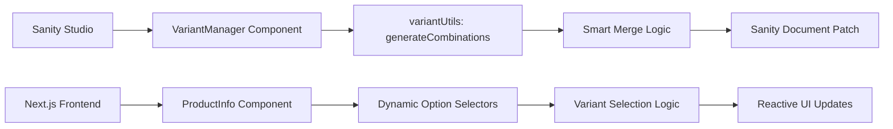

# Requirements

### Overview & Goals
Upgrade the current fixed variant system (Color/Size) to a production-grade, flexible system similar to Shopify. This allows merchants to define any number of options (e.g., Material, Storage, Style) and automatically generate all possible combinations while preserving manual edits like price, SKU, and stock.

### Scope
- **In Scope**:
  - Dynamic option creation (Name and Values).
  - One-click variant generation in Sanity Studio.
  - Smart merging of variants to preserve existing data.
  - Comprehensive variant fields (SKU, Price, Compare at, Stock, Barcode, Weight, Dimensions, Images, Status, Low stock).
  - Conditional UI in Sanity (Base fields vs Variant fields).
  - Dynamic frontend selection UI.
- **Out of Scope**:
  - Multi-location inventory (future feature).
  - Advanced bundling logic (future feature).
  - Automated price rules based on options.

### Functional Requirements
- Admin can add any number of options (e.g., "Storage" with values "128GB", "256GB").
- Clicking "Generate Variants" creates the Cartesian product of all options.
- Existing variants (matched by stable human-readable ID) are NOT overwritten when regenerating.
- Variants no longer matching current options are removed.
- Each variant has its own inventory, pricing, and image gallery.
- Simple products (no variants) use base product fields.

# Technical Design

### Current Implementation
The project uses a hardcoded `variants` array in `productType.ts` with fields for `color`, `size`, `stock`, `price`, and `variantImage`. The frontend `ProductInfo.tsx` manually manages `selectedColor` and `selectedSize` states.

### Key Decisions
- **Stable ID Strategy**: Use human-readable strings like `Color:Red,Size:XL`. The keys in the ID will be sorted alphabetically (e.g., `Color:Red,Size:XL` instead of `Size:XL,Color:Red`) to ensure consistency and simplify the merging logic.
- **Data Preservation**: The `VariantManager` will perform a "diff and merge" operation rather than a blind overwrite. It will match incoming combinations against existing variants using the `variantId`.
- **Conditional Schema**: Use Sanity `hidden` property based on the `hasVariants` boolean to keep the Studio UI clean.
- **Frontend State**: Shift from individual option states to a single `selectedOptions` record/map, allowing for an unlimited number of options without adding new `useState` hooks.

### Data Model
#### Product Document
```typescript
{
  hasVariants: boolean;
  options: { name: string; values: string[] }[];
  variants: Variant[];
  // Base fields (used if hasVariants is false)
  price: number;
  stock: number;
  sku: string;
}
```

#### Variant Object
```typescript
{
  variantId: string; // e.g. "Size:L,Color:Blue"
  title: string;
  optionValues: { option: string; value: string }[];
  sku: string;
  price: number;
  compareAtPrice: number;
  stock: number;
  barcode: string;
  weight: number;
  dimensions: { length: number; width: number; height: number };
  images: Image[];
  status: "active" | "draft";
  featuredImage: Image;
  lowStockThreshold: number;
}
```

### Architecture Diagram


### Proposed Changes
- **Sanity Utilities**: `sanity/utils/variantUtils.ts` for Cartesian product logic.
- **Sanity Component**: `sanity/components/VariantManager.tsx` for the "Generate" button and list management.
- **Frontend State**: `ProductInfo.tsx` will use `useMemo` to find the current variant whenever `selectedOptions` changes.
- **Characteristics**: `ProductCharacteristics.tsx` will iterate over `selectedVariant` keys to show all details.

# Implementation Prompt

### Suggested Prompt for Implementation Agent
If you need to re-state this task to an implementation agent or another developer, you can use the following prompt:

> "Implement a production-grade product variant system in my Next.js and Sanity CMS project. 
> 
> **Key Requirements:**
> 1. **Dynamic Options**: Allow merchants to define arbitrary product options (e.g., Size, Color, Material) with multiple values in Sanity Studio.
> 2. **One-Click Generation**: Create a 'Generate Variants' button in Sanity that builds all possible combinations (Cartesian product) of the defined options.
> 3. **Data Integrity**: When regenerating variants, ensure existing data (like custom prices, SKUs, and stock levels) is preserved for combinations that still exist. Remove only orphaned variants and add only new ones.
> 4. **Rich Variant Data**: Each variant must support SKU, Price, Compare at Price, Stock, Images, and Dimensions.
> 5. **Frontend Refactor**: Update the product page to dynamically render selectors for every defined option and reactively update the displayed price, stock, and images based on the selected variant.
> 6. **Uniformity**: Use a conditional schema so that 'Simple Products' (no variants) use base fields, while 'Variable Products' use the variant list."

# Testing

### Validation Approach
Verification will focus on the data integrity during variant generation and the reactivity of the frontend selection.

### Key Scenarios
- **Simple Product**: Verify base price/stock are used when `hasVariants` is false.
- **Option Change**: Add a new option, click generate, and verify existing variant data (price/SKU) for other combinations is preserved.
- **Option Removal**: Remove a value, click generate, and verify the corresponding variants are removed (Automatic Cleanup).
- **Frontend Selection**: Select various option combinations and verify the price and image gallery update correctly.
- **Out of Stock**: Verify the "Add to Cart" button reflects the stock level of the specific selected variant.

### Edge Cases
- **Duplicate Option Names**: Validation rule to prevent duplicate names/values.
- **Large Number of Combinations**: Check performance when generating 100+ variants.
- **Missing Images**: Fallback to main product images if a variant has no specific images.

# Delivery Steps

###   Step 1: Define data model and variant generation utilities
Update the Sanity schema and create core utilities for variant generation.

- Update `sanity/schemaTypes/productType.ts` with `productOption` and `productVariant` definitions.
- Add `hasVariants` and `options` fields to the `product` document.
- Create `sanity/utils/variantUtils.ts` containing `generateCombinations` and `createStableId` functions.
- Define TypeScript interfaces for the new data structures.

###   Step 2: Implement Sanity Variant Manager component
Create a custom Sanity Studio component to manage variant generation.

- Implement `sanity/components/VariantManager.tsx` using `useFormValue` and `PatchEvent`.
- Add a "Generate Variants" button that performs smart merging (adding new, preserving existing, removing orphaned).
- Register the custom component as the input for the `variants` field in `productType.ts`.
- Add field groups to `productType.ts` to show/hide fields based on the `hasVariants` toggle.

###   Step 3: Update frontend for dynamic variant selection
Refactor the product page to handle dynamic variants.

- Update `components/ProductInfo.tsx` to use a flexible `selectedOptions` state instead of fixed color/size.
- Dynamically render selection controls for every option defined in Sanity.
- Implement logic to find the active variant based on current selections.
- Ensure price, stock, and description reactively update.

###   Step 4: Finalize frontend integration and inventory display
Complete the integration for cart and characteristics.

- Update `components/AddToCartButton.tsx` to display selected option values dynamically.
- Modify `components/ProductCharacteristics.tsx` to list all variant-specific attributes (SKU, weight, dimensions, etc.).
- Update `components/ImageView.tsx` (if needed) to handle variant-specific image lists seamlessly.
- Verify inventory tracking logic across all components.